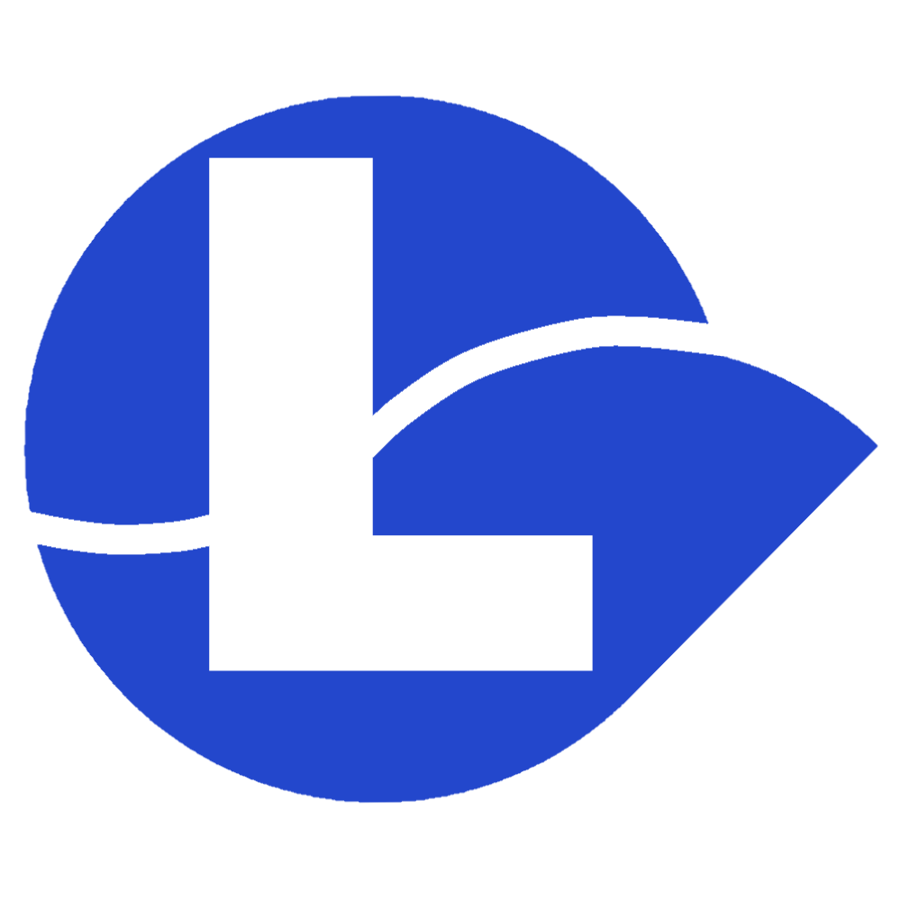

<h1 align="center">loftylauncher BETA</h1>

<em><h5 align="center">(formerly Electron Launcher end heiloscord)</h5></em>

[
](https://github.com/kasycorp/loftylauncher/actions)  

un launcher utilisable partout.

